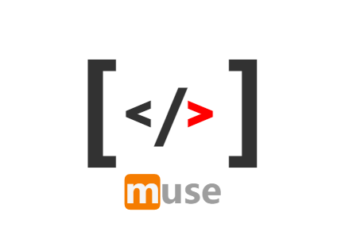

​        muse （英：缪斯/中：暮色/本：[m use]多种用途）, 如本意所述，本框架的定位是做一个多种用途的框架。但因部分功能每个项目都有差别，所以并不会以类库的形式出现而是在文档中提供使用思路。 

​		muse可以将业务`API`声明为可发布服务，然后通过配置服务发布规则，真正的把业务逻辑发布为服务。然后服务接入层，将服务以不同的技术方式暴露出去。发布规则中描述了`API` 对应的方法的`参数赋值规则`、`校验规则`、`业务逻辑指向(必选)`、`处理结果的掩码`

​        muse可以为程序中的SPI生成代理，并将SPI的调用转发到不同的代理处理器进行处理，隔离业务逻辑与技术细节。

## 功能架构图

 ## 功能概览

- 原生基于规则的权限控制
- 内置赋值、校验、掩码功能
- 统一的参数安全校验，便捷的校验扩展
- 统一的协议格式，及错误码管理
- 多形态发布服务(参考入门代码示例)
- 多数据源支持(待)
- 数据挡板(待)
- API文档生成(待)
- 远程问题调试(待)

### [入门代码示例](doc/example.md)
### [使用指引](doc/guid.md)

